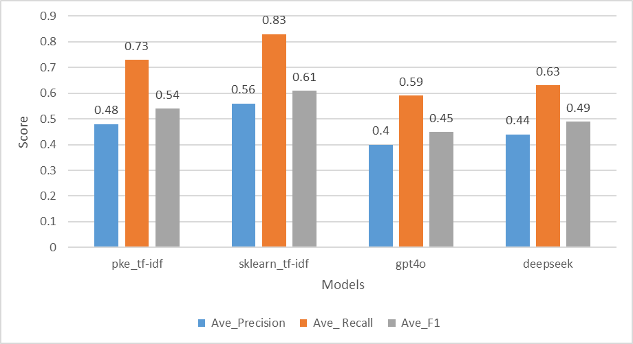

# **NLP入门**

## **一、预备知识**

### **1. 大模型 API 调用**

**1.1 基本概念**

在使用大模型 API 时，一般遵循以下几个步骤：

1. 获取 API Key：注册并申请相应的 API 访问权限。
2. 初始化 API 客户端：用 Python 代码连接大模型 API。
3. 构造请求：

   - System Role（系统角色）：定义 AI 的行为，如「你是一个 AI 助手」。
   - User Message（用户输入）：用户的输入信息，如「请帮我写一封求职信」。
4. 发送请求：调用 API，传递消息，并等待 AI 生成回复。
5. 解析 API 响应：提取 AI 生成的内容。

**1.2 ChatGPT API调用**

```python
from openai import OpenAI

# 初始化 OpenAI 客户端
client = OpenAI(api_key="你的 OpenAI API Key")

def chat_with_gpt(user_input):
    """
    发送用户输入给 OpenAI API，并获取 GPT-4o 的回复
    """
    response = client.chat.completions.create(
        model="gpt-4o",  # 选择 GPT-4o 模型
        messages=[
            {"role": "system", "content": "你是一个智能 AI 助手，可以回答各种问题。"},
            {"role": "user", "content": user_input}
        ]
    )
    # 返回 AI 生成的文本
    return response.choices[0].message.content.strip()

if __name__ == "__main__":
    user_input = "请解释量子计算的基本概念。"
    response = chat_with_gpt(user_input)
    print("AI 回复：", response)

```

[[OpenAI官网](https://platform.openai.com/)]

**1.3 Deepseek API调用**

```python
from openai import OpenAI

# 初始化 DeepSeek 客户端
client = OpenAI(
    api_key="你的 DeepSeek API Key",
    base_url="https://api.deepseek.com"
)

def chat_with_deepseek(user_input):
    """
    发送用户输入给 DeepSeek API，并获取回复（包含推理过程和最终答案）
    """
    response = client.chat.completions.create(
        model="deepseek-reasoner",  # 选择 DeepSeek 推理模型
        messages=[
            {"role": "system", "content": "你是一个智能 AI 助手，能够进行深度推理和回答各种问题。"},
            {"role": "user", "content": user_input}
        ]
    )

    # 获取 DeepSeek 的推理过程和最终回答
    reasoning_content = response.choices[0].message.reasoning_content
    content = response.choices[0].message.content

    return reasoning_content, content


if __name__ == "__main__":
    user_input = "请解释机器学习的基本概念。"
    reasoning, response = chat_with_deepseek(user_input)
    print("DeepSeek 推理过程：", reasoning)
    print("\nDeepSeek 最终回答：", response)

```

[[Deepseek官网](https://platform.deepseek.com/)]


### **2. Precision / Recall / F1 评价指标**

**2.1 Precision（精准率**）

衡量的是 模型预测出的关键词中，有多少是真正正确的关键词。它关注的是 预测结果的质量。

📌 公式

$$\text{Precision} = \frac{TP}{TP + FP}$$

其中：

- TP（True Positives）：正确预测的关键词。
- FP（False Positives）：错误预测的关键词。

**2.2 Recall（召回率）**

衡量的是 真实关键词中，有多少被模型成功预测出。它关注的是 覆盖率，即正确预测的比例。

📌 公式

$$\text{Recall} = \frac{TP}{TP + FN}$$

其中：

- TP（True Positives）：正确预测的关键词。
- FN（False Negatives）：模型没有预测但实际上是真实关键词。

**2.3 F1-score（F1值）**

是 Precision 和 Recall 的调和平均数，用于综合评估模型的表现。

📌 公式

$$\text{F1-score} = 2 \times \frac{\text{Precision} \times \text{Recall}}{\text{Precision} + \text{Recall}}$$


### **3. Inspec 测试集介绍**

我们使用 Inspec 测试集 作为关键词提取任务的评估数据集。

**3.1 数据集格式**

数据集包含大量文档，以 JSON格式 储存文档数据，每个文档数据占一行，包含以下字段：

```json
{
  "document_id": "2150",
  "tokens": [["Data", "storage", ":", "re-format", "."], ["Closely", "tracking", "a", "fast-moving", "sector"]],
  "tokens_pos": [["NNS", "NN", ":", "NN", "."], ["RB", "VBG", "DT", "JJ", "NN"]],
  "tokens_stem": [["datum", "storage", ":", "re-format", "."], ["closely", "track", "a", "fast-moving", "sector"]],
  "keyphrases": ["build manag", "data center", "build infrastructur", "mission-crit facil"]
}

```

| 字段名      | 含义                                             |
| :---------- | ------------------------------------------------ |
| document_id | 文档的唯一编号                                   |
| tokens      | 文档的原始文本，按单词分割，每个句子是一个列表。 |
| tokens_pos  | 每个 token 的词性标注（POS Tagging）             |
| tokens_stem | 词干化后的 token（stemming）                     |
| keyphrases  | 该文档的 真实关键词（ground truth keyphrases）   |

**3.2 如何使用 Inspec 测试集评估模型效果**

1. 输入数据：

   读取 `tokens` 字段，还原原始文本，作为输入传递给关键词提取模型。

2. 模型预测：

   让模型从文档文本中 自动提取关键词。

3. 与真值对比：

   将模型预测的关键词与 `keyphrases` 进行比对，计算评估指标（Precision、Recall、F1-score）。

   

### **4. pke TF-IDF 方法**

**4.1 pke介绍**

`pke`（Python Keyphrase Extraction）是一个用于 关键词提取 的 Python 库，支持 多种关键词提取方法，包括：

- TF-IDF（词频-逆文档频率）
- TextRank（基于图的关键词提取）
- MultipartiteRank（多部分图）
- PositionRank（考虑单词位置）
- YAKE（基于统计特征）
- KEA（基于机器学习）

**4.2 pke方法介绍**

1. **`pke.unsupervised.TfIdf()`**：初始化 TF-IDF 关键词提取器。

2. **`extractor.load_document(input=text, language='en', stoplist=stoplist)`**：加载文本文档，并去除 停用词。

3. **`extractor.candidate_selection()`**：选择候选关键词，默认提取 名词短语。

4. **`extractor.candidate_weighting()`**：计算 TF-IDF 权重，给每个候选关键词赋予得分。

5. **`extractor.get_n_best(n=top_n)`**：获取最高分的 N 个关键词，返回一个 `[(keyword, score), ...]` 形式的列表。


### **5. sklearn TF-IDF 方法**

**5.1 sklearn介绍**

是 Python 最流行的机器学习库 之一，由多个 子模块 组成，每个模块负责不同的任务。

在本次特征抽取任务中，我们使用的是 `sklearn.feature_extraction`模块中的 `TfidfVectorizer`方法。

**5.2 sklearn方法介绍**

1. `TfidfVectorizer(stop_words=stoplist, max_features=5000)`

   初始化 TF-IDF 向量化器，用于计算 文本中每个词的 TF-IDF 权重。

   参数：

   - stop_words=stoplist：去除停用词。

   - max_features=5000：限制最多保留 5000 个特征，提高计算效率。

2. `vectorizer.fit_transform([text])`

   计算 TF-IDF 矩阵，返回 (1, N) 维稀疏矩阵，表示文本中每个单词的 TF-IDF 值。其中 N 是 max_features 限定的特征数量。

3. `vectorizer.get_feature_names_out()`

   获取词汇表，即 TfidfVectorizer 解析出的所有 关键词列表。

**5.3 补充**

在5.2的基础上，再使用Python 内置方法进一步处理即可得到 top_n 关键词。

1. `X.toarray()[0]`

   转换 TF-IDF 矩阵为 NumPy 数组，获取每个词对应的 TF-IDF 值。

2. `dict(zip(feature_array, tfidf_scores))`

   构造字典 {单词: TF-IDF 权重}，用于 存储关键词及其对应权重。

3. `sorted(tfidf_dict, key=tfidf_dict.get, reverse=True)[:top_n]`

   按 TF-IDF 值排序，选取权重最高的前 top_n 个关键词作为最终输出。

------

## **二、文本分析工具——微词云介绍**

我们可以使用 **微词云** 对文本的词频进行可视化分析。[[微词云官网](https://www.weiciyun.com/)]

### **1. [分词] 与 [词频统计和词云生成]**

**1.1 输入内容**

* 支持txt、excel多行、doc等等。
* 示例内容

```txt
随着人工智能（AI）技术的飞速发展，自然语言处理（Natural Language Processing, NLP）已成为人工智能领域的重要研究方向。NLP 旨在让计算机能够理解、生成和处理人类语言，使其具备类似人类的语言能力。这一技术的核心在于对语音、文本等语言数据的分析与建模。

目前，NLP 在多个领域得到了广泛应用。例如，在机器翻译方面，像 Google 翻译和 DeepL 这样的系统已经能够实现多语言之间的高质量翻译。在文本摘要领域，NLP 可以自动提取文章的核心内容，提高信息获取效率。此外，智能客服系统也大量依赖 NLP 技术，通过自然语言理解（NLU）分析用户意图，并生成符合语境的自动回复。

近年来，深度学习的兴起极大地推动了 NLP 技术的发展。基于 Transformer 结构的模型（如 BERT、GPT-4、T5 等）已经在文本分类、情感分析、问答系统等任务上取得了显著进展。这些模型通过大规模预训练，能够从海量数据中学习语言模式，并在下游任务中展现强大的泛化能力。

尽管 NLP 取得了长足进步，但仍然面临诸多挑战。例如，如何让模型理解语义的细微差别、如何减少对训练数据的依赖、如何提高模型的可解释性等，都是当前研究的热点。此外，跨语言迁移学习、低资源语言处理、多模态融合等方向也成为 NLP 研究的新趋势。

未来，随着计算能力的提升和数据资源的丰富，NLP 技术将进一步突破局限，为人类社会带来更多创新应用。从智能对话助手到自动文本生成，从医疗诊断到法律文档解析，NLP 正在不断改变我们的生活方式，为信息社会的发展提供强有力的支持。
```

**1.2 得到报告**

- 打标词表
- 词频
- 词性统计、词汇位置分布、...

**1.3 构造词云**


### **2. 其他功能**

* 文本情感分析

* 词语网络关系图

* 批量文本分词

------

## **三、关键词提取代码实现**

我们将实现 **四种关键词提取方法**，并在 Inspec 测试集上进行对比。

### **1. pke TF-IDF**

- 代码实现

  ```python
  import json
  import time
  import string
  import pke
  import nltk
  from nltk.corpus import stopwords
  from nltk.stem import PorterStemmer
  
  # 下载 nltk 需要的资源
  nltk.download('stopwords')
  nltk.download('punkt')
  
  # 初始化 Porter 词干化器
  ps = PorterStemmer()
  
  # 设置停用词
  stoplist = stopwords.words('english') + list(string.punctuation)
  
  
  def extract_keywords_with_tfidf(text, top_n=10):
      """
      使用 pke 的 TF-IDF 方法提取关键词。
      """
      try:
          # 初始化 TF-IDF 提取器
          extractor = pke.unsupervised.TfIdf()
          extractor.load_document(input=text, language='en', stoplist=stoplist)
  
          # 提取关键词
          extractor.candidate_selection()
          extractor.candidate_weighting()
  
          # 获取 top_n 关键词
          keywords = [kw[0] for kw in extractor.get_n_best(n=top_n)]
          return keywords
      except Exception as e:
          print(f"TF-IDF 关键词提取失败: {e}")
          return []
  
  
  def stem_words(word_list):
      """
      词干化（Stemming）以保证一致性
      """
      return {" ".join([ps.stem(word) for word in phrase.split()]) for phrase in word_list}
  
  
  def fuzzy_match(predicted, ground_truth):
      """
      子串匹配：如果 predicted 和 ground_truth 之间有部分重叠，则算作匹配
      """
      return any(gt in predicted or predicted in gt for gt in ground_truth)
  
  
  def evaluate_prediction(predicted_list, ground_truth_list):
      """
      计算 Precision / Recall / F1-score
      - 词干化
      - 允许子串匹配（"data center market" vs "data center" 也算匹配）
      """
      pred_set = set(predicted_list)
      gt_set = set(ground_truth_list)
  
      tp = sum(1 for pred in pred_set if fuzzy_match(pred, gt_set))
      fp = len(pred_set) - tp
      fn = len(gt_set) - tp
  
      precision = tp / (tp + fp + 1e-9)
      recall = tp / (tp + fn + 1e-9)
      f1 = 2 * precision * recall / (precision + recall + 1e-9)
  
      return precision, recall, f1
  
  
  def main():
      total_p, total_r, total_f1 = 0.0, 0.0, 0.0
      count = 0
  
      with open("test.json", "r", encoding="utf-8") as f:
          for line in f:
              line = line.strip()
              if not line:
                  continue
              record = json.loads(line)
  
              doc_id = record["document_id"]
              tokens_2d = record["tokens"]
  
              # 拼接 tokens 为文本
              tokens_flat = [token for line in tokens_2d for token in line]
              text = " ".join(tokens_flat)
  
              # 词干化 keyphrases
              ground_truth = stem_words(record["keyphrases"])
  
              # 使用 pke TF-IDF 提取关键词
              predicted_list = extract_keywords_with_tfidf(text)
              predicted_list = stem_words(predicted_list)
  
              # 评估
              p, r, f1 = evaluate_prediction(predicted_list, ground_truth)
              count += 1
  
              print(f"[Doc ID={doc_id}]")
              print(f"  Predicted: {predicted_list}")
              print(f"  True Keyphrases: {ground_truth}")
              print(f"  Precision={p:.2f}, Recall={r:.2f}, F1={f1:.2f}\n")
  
              total_p += p
              total_r += r
              total_f1 += f1
  
              # 适当延迟，避免文件读取过快
              time.sleep(0.1)
  
      # **计算并打印总平均 Precision, Recall, F1**
      if count > 0:
          avg_p = total_p / count
          avg_r = total_r / count
          avg_f1 = total_f1 / count
          print("\n=== 结果汇总 ===")
          print(f"文档总数: {count}")
          print(f"平均 Precision={avg_p:.2f}, 平均 Recall={avg_r:.2f}, 平均 F1={avg_f1:.2f}")
      else:
          print("未读取到有效的 JSON 数据。")
  
  
  if __name__ == "__main__":
      main()
  
  ```

- 运行结果示例

  ```txt
  
  ......
  ......
  ......
  
  [Doc ID=345]
    Predicted: {'strateg oper', 'sustain', 'strateg inform system', 'strateg', 'strateg oper research', 'sustain competit advantag', 'si', 'inform system -lrb-', 'ms work', 'system -lrb-'}
    True Keyphrases: {'manag scienc', 'strateg inform system', 'si', 'strateg or/m', 'oper research'}
    Precision=0.40, Recall=0.80, F1=0.53
  
  
  === 结果汇总 ===
  文档总数: 20
  平均 Precision=0.48, 平均 Recall=0.73, 平均 F1=0.54
  ```

  

### **2. sklearn TF-IDF**

- 代码实现

  ```python
  import json
  import time
  import string
  import nltk
  from sklearn.feature_extraction.text import TfidfVectorizer
  from nltk.corpus import stopwords
  from nltk.stem import PorterStemmer
  
  # 下载 nltk 需要的资源
  nltk.download('stopwords')
  nltk.download('punkt')
  
  # 初始化 Porter 词干化器
  ps = PorterStemmer()
  
  # 设置停用词
  stoplist = stopwords.words('english') + list(string.punctuation)
  
  
  def extract_keywords_with_sklearn(text, top_n=10):
      """
      使用 sklearn 的 TfidfVectorizer 提取关键词
      """
      try:
          # 初始化 TF-IDF 向量器
          vectorizer = TfidfVectorizer(stop_words=stoplist, max_features=5000)
  
          # 计算 TF-IDF 矩阵
          X = vectorizer.fit_transform([text])
  
          # 获取词汇表和对应的 TF-IDF 分数
          feature_array = vectorizer.get_feature_names_out()
          tfidf_scores = X.toarray()[0]
  
          # 选取最高分数的前 top_n 个关键词
          tfidf_dict = dict(zip(feature_array, tfidf_scores))
          sorted_keywords = sorted(tfidf_dict, key=tfidf_dict.get, reverse=True)[:top_n]
  
          return sorted_keywords
      except Exception as e:
          print(f"sklearn TF-IDF 关键词提取失败: {e}")
          return []
  
  
  def stem_words(word_list):
      """
      词干化（Stemming）以保证一致性
      """
      return {" ".join([ps.stem(word) for word in phrase.split()]) for phrase in word_list}
  
  
  def fuzzy_match(predicted, ground_truth):
      """
      子串匹配：如果 predicted 和 ground_truth 之间有部分重叠，则算作匹配
      """
      return any(gt in predicted or predicted in gt for gt in ground_truth)
  
  
  def evaluate_prediction(predicted_list, ground_truth_list):
      """
      计算 Precision / Recall / F1-score
      - 词干化
      - 允许子串匹配（"data center market" vs "data center" 也算匹配）
      """
      pred_set = set(predicted_list)
      gt_set = set(ground_truth_list)
  
      tp = sum(1 for pred in pred_set if fuzzy_match(pred, gt_set))
      fp = len(pred_set) - tp
      fn = len(gt_set) - tp
  
      precision = tp / (tp + fp + 1e-9)
      recall = tp / (tp + fn + 1e-9)
      f1 = 2 * precision * recall / (precision + recall + 1e-9)
  
      return precision, recall, f1
  
  
  def main():
      total_p, total_r, total_f1 = 0.0, 0.0, 0.0
      count = 0
  
      with open("test.json", "r", encoding="utf-8") as f:
          for line in f:
              line = line.strip()
              if not line:
                  continue
              record = json.loads(line)
  
              doc_id = record["document_id"]
              tokens_2d = record["tokens"]
  
              # 拼接 tokens 为文本
              tokens_flat = [token for line in tokens_2d for token in line]
              text = " ".join(tokens_flat)
  
              # 词干化 keyphrases
              ground_truth = stem_words(record["keyphrases"])
  
              # 使用 sklearn TF-IDF 提取关键词
              predicted_list = extract_keywords_with_sklearn(text)
              predicted_list = stem_words(predicted_list)
  
              # 评估
              p, r, f1 = evaluate_prediction(predicted_list, ground_truth)
              count += 1
  
              print(f"[Doc ID={doc_id}]")
              print(f"  Predicted: {predicted_list}")
              print(f"  True Keyphrases: {ground_truth}")
              print(f"  Precision={p:.2f}, Recall={r:.2f}, F1={f1:.2f}\n")
  
              total_p += p
              total_r += r
              total_f1 += f1
  
              # 适当延迟，避免文件读取过快
              time.sleep(0.1)
  
      # **计算并打印总平均 Precision, Recall, F1**
      if count > 0:
          avg_p = total_p / count
          avg_r = total_r / count
          avg_f1 = total_f1 / count
          print("\n=== 结果汇总 ===")
          print(f"文档总数: {count}")
          print(f"平均 Precision={avg_p:.2f}, 平均 Recall={avg_r:.2f}, 平均 F1={avg_f1:.2f}")
      else:
          print("未读取到有效的 JSON 数据。")
  
  
  if __name__ == "__main__":
      main()
  
  ```

- 运行结果示例

  ```txt
  
  ......
  ......
  ......
  
  [Doc ID=345]
    Predicted: {'ms', 'contain', 'found', 'si', 'strateg', 'advantag', 'inform', 'work', 'mani', 'examin'}
    True Keyphrases: {'si', 'strateg inform system', 'strateg or/m', 'oper research', 'manag scienc'}
    Precision=0.30, Recall=0.60, F1=0.40
  
  
  === 结果汇总 ===
  文档总数: 20
  平均 Precision=0.56, 平均 Recall=0.83, 平均 F1=0.61
  ```

  

### **3. ChatGPT-4o**

- API 调用代码

  ```python
  import json
  import time
  from openai import OpenAI
  from nltk.stem import PorterStemmer
  
  # 初始化 ChatGPT API 客户端
  client = OpenAI(
      api_key="你的 OpenAI API Key")
  
  # 初始化 Porter 词干化器
  ps = PorterStemmer()
  
  
  def extract_keywords_with_chatgpt(text):
      """
      调用 ChatGPT 接口对文本进行关键词提取，并确保返回短语格式与 keyphrases 一致。
      """
      prompt = f"""
      你是一位专业的自然语言处理专家。请从以下文本中抽取最能反映主要内容或主题的关键词：
      {text}
  
      **输出要求**：
      - 关键词短语必须经过词干化（如 "building management" → "build manag"）。
      - 只返回关键短语，每个短语之间用逗号分隔，不要写完整句子。
      - 例如："data center, build infrastructur, secur system"
      """
  
      try:
          completion = client.chat.completions.create(
              model="gpt-4o",  # 你可以改成 "gpt-3.5-turbo" 以节省成本
              messages=[
                  {
                      "role": "system",
                      "content": "你是一位专业的自然语言处理专家。请根据用户提供的文本进行关键词抽取。"
                  },
                  {
                      "role": "user",
                      "content": prompt
                  }
              ]
          )
  
          keywords_str = completion.choices[0].message.content.strip()
          return keywords_str
  
      except Exception as e:
          print(f"ChatGPT API 调用失败: {e}")
          return ""
  
  
  def stem_words(word_list):
      """
      将关键词短语进行词干化（Stemming）
      """
      return {" ".join([ps.stem(word) for word in phrase.split()]) for phrase in word_list}
  
  
  def parse_keywords(keyword_str):
      """
      将GPT返回的逗号分隔关键词字符串拆分成列表，并进行词干化
      """
      raw_keywords = [k.strip() for k in keyword_str.split(",") if k.strip()]
      return list(stem_words(raw_keywords))
  
  
  def fuzzy_match(predicted, ground_truth):
      """
      子串匹配：若 predicted 和 ground_truth 之间有部分重叠，则算作匹配
      """
      return any(gt in predicted or predicted in gt for gt in ground_truth)
  
  
  def evaluate_prediction(predicted_list, ground_truth_list):
      """
      计算 Precision / Recall / F1 分数
      - 词干化
      - 允许子串匹配（"data center market" vs "data center" 也算匹配）
      """
      pred_set = set(predicted_list)
      gt_set = set(ground_truth_list)
  
      tp = sum(1 for pred in pred_set if fuzzy_match(pred, gt_set))
      fp = len(pred_set) - tp
      fn = len(gt_set) - tp
  
      precision = tp / (tp + fp + 1e-9)
      recall = tp / (tp + fn + 1e-9)
      f1 = 2 * precision * recall / (precision + recall + 1e-9)
  
      return precision, recall, f1
  
  
  def main():
      total_p, total_r, total_f1 = 0.0, 0.0, 0.0
      count = 0
  
      with open("test.json", "r", encoding="utf-8") as f:
          for line in f:
              line = line.strip()
              if not line:
                  continue
              record = json.loads(line)
  
              doc_id = record["document_id"]
              tokens_2d = record["tokens"]
  
              # 拼接 tokens 为文本
              tokens_flat = [token for line in tokens_2d for token in line]
              text = " ".join(tokens_flat)
  
              # 词干化 keyphrases
              ground_truth = stem_words(record["keyphrases"])
  
              # 调用 ChatGPT 抽取关键词
              predicted_str = extract_keywords_with_chatgpt(text)
              predicted_list = parse_keywords(predicted_str)
  
              # 评估
              p, r, f1 = evaluate_prediction(predicted_list, ground_truth)
              count += 1
  
              print(f"[Doc ID={doc_id}]")
              print(f"  Predicted: {predicted_list}")
              print(f"  True Keyphrases: {ground_truth}")
              print(f"  Precision={p:.2f}, Recall={r:.2f}, F1={f1:.2f}\n")
  
              total_p += p
              total_r += r
              total_f1 += f1
  
              # 防止 API 速率限制，每次调用后休息 1 秒
              time.sleep(1)
  
      if count > 0:
          avg_p = total_p / count
          avg_r = total_r / count
          avg_f1 = total_f1 / count
          print("\n=== 结果汇总 ===")
          print(f"文档总数: {count}")
          print(f"平均 Precision={avg_p:.2f}, 平均 Recall={avg_r:.2f}, 平均 F1={avg_f1:.2f}")
      else:
          print("未读取到有效的 JSON 数据。")
  
  
  if __name__ == "__main__":
      main()
  
  ```

- 运行结果示例

  ```txt
  
  ......
  ......
  ......
  
  [Doc ID=345]
    Predicted: ['strateg inform system', 'sustain advantag', 'strateg oper', 'inform technolog', 'edelman prize', 'privat sector', 'or/m work', 'compet advantag', 'applic strateg']
    True Keyphrases: {'strateg inform system', 'manag scienc', 'oper research', 'strateg or/m', 'si'}
    Precision=0.11, Recall=0.20, F1=0.14
  
  
  === 结果汇总 ===
  文档总数: 20
  平均 Precision=0.40, 平均 Recall=0.59, 平均 F1=0.45
  ```

### **4. DeepSeek**

- API 调用代码

  ```python
  import json
  import time
  from openai import OpenAI
  from nltk.stem import PorterStemmer
  
  # 初始化 DeepSeek API 客户端
  client = OpenAI(
      api_key="你的 DeepSeek API Key",
      base_url="https://api.deepseek.com"
  )
  
  # 初始化 Porter 词干化器
  ps = PorterStemmer()
  
  
  def extract_keywords_with_deepseek(text):
      """
      使用 DeepSeek `deepseek-reasoner` 提取关键词。
      """
      messages = [
          {
              "role": "system",
              "content": (
                  "你是一位专业的自然语言处理专家。"
                  "请根据用户提供的文本，抽取出其中最能反映文本主题的关键词，"
                  "并使用逗号进行分隔。"
              )
          },
          {
              "role": "user",
              "content": f"这是我想要提取关键词的文本：\n{text}\n"
          }
      ]
  
      try:
          response = client.chat.completions.create(
              model="deepseek-reasoner",
              messages=messages
          )
  
          # DeepSeek 返回的数据格式
          content = response.choices[0].message.content.strip()
          return content
      except Exception as e:
          print(f"DeepSeek API 调用失败: {e}")
          return ""
  
  
  def stem_words(word_list):
      """
      将关键词短语进行词干化（Stemming）
      """
      return {" ".join([ps.stem(word) for word in phrase.split()]) for phrase in word_list}
  
  
  def parse_keywords(keyword_str):
      """
      解析 DeepSeek 返回的逗号分隔的关键词字符串，并进行词干化
      """
      raw_keywords = [k.strip() for k in keyword_str.split(",") if k.strip()]
      return list(stem_words(raw_keywords))
  
  
  def fuzzy_match(predicted, ground_truth):
      """
      子串匹配：若 predicted 和 ground_truth 之间有部分重叠，则算作匹配
      """
      return any(gt in predicted or predicted in gt for gt in ground_truth)
  
  
  def evaluate_prediction(predicted_list, ground_truth_list):
      """
      计算 Precision / Recall / F1-score
      - 词干化
      - 允许子串匹配（"data center market" vs "data center" 也算匹配）
      """
      pred_set = set(predicted_list)
      gt_set = set(ground_truth_list)
  
      tp = sum(1 for pred in pred_set if fuzzy_match(pred, gt_set))
      fp = len(pred_set) - tp
      fn = len(gt_set) - tp
  
      precision = tp / (tp + fp + 1e-9)
      recall = tp / (tp + fn + 1e-9)
      f1 = 2 * precision * recall / (precision + recall + 1e-9)
  
      return precision, recall, f1
  
  
  def main():
      total_p, total_r, total_f1 = 0.0, 0.0, 0.0
      count = 0
  
      with open("test.json", "r", encoding="utf-8") as f:
          for line in f:
              line = line.strip()
              if not line:
                  continue
              record = json.loads(line)
  
              doc_id = record["document_id"]
              tokens_2d = record["tokens"]
  
              # 拼接 tokens 为文本
              tokens_flat = [token for line in tokens_2d for token in line]
              text = " ".join(tokens_flat)
  
              # 词干化 keyphrases
              ground_truth = stem_words(record["keyphrases"])
  
              # 使用 DeepSeek 提取关键词
              predicted_str = extract_keywords_with_deepseek(text)
              predicted_list = parse_keywords(predicted_str)
  
              # 评估
              p, r, f1 = evaluate_prediction(predicted_list, ground_truth)
              count += 1
  
              print(f"[Doc ID={doc_id}]")
              print(f"  Predicted: {predicted_list}")
              print(f"  True Keyphrases: {ground_truth}")
              print(f"  Precision={p:.2f}, Recall={r:.2f}, F1={f1:.2f}\n")
  
              total_p += p
              total_r += r
              total_f1 += f1
  
              # 防止 API 速率限制，每次调用后休息 1 秒
              time.sleep(1)
  
      # **计算并打印总平均 Precision, Recall, F1**
      if count > 0:
          avg_p = total_p / count
          avg_r = total_r / count
          avg_f1 = total_f1 / count
          print("\n=== 结果汇总 ===")
          print(f"文档总数: {count}")
          print(f"平均 Precision={avg_p:.2f}, 平均 Recall={avg_r:.2f}, 平均 F1={avg_f1:.2f}")
      else:
          print("未读取到有效的 JSON 数据。")
  
  
  if __name__ == "__main__":
      main()
  ```

- 运行结果示例

  ```txt
  
  ......
  ......
  ......
  
  [Doc ID=345]
    Predicted: ['privat sector applic', 'high or/m content', 'sustain competit advantag', 'strateg inform system (sis)', 'sustain advantag', 'inform technolog', 'edelman prize finalist articl', 'or/m literatur', 'strateg or/m', 'competit advantag framework']
    True Keyphrases: {'manag scienc', 'si', 'oper research', 'strateg inform system', 'strateg or/m'}
    Precision=0.20, Recall=0.40, F1=0.27
  
  
  === 结果汇总 ===
  文档总数: 20
  平均 Precision=0.44, 平均 Recall=0.63, 平均 F1=0.49
  ```

------

## **四、结论与反思**

### **1. 模型性能对比**

**1.1 可视化对比结果**



**1.2 各方法优劣势分析**

* 运行速度：sklearn > pke > gpt4o > deepseek
* 预测水平：sklearn > pke > deepseek > gpt4o

### **2. 不足之处**

- 提示词可以进一步优化，进而提升两个大模型的预测水平。
- 作为演示，只选取了测试集500条数据中的20条进行测试，如果想要准确评估模型性能，选择100-200条更为合适。
- 预测出的关键词与实值的校准逻辑有待进一步优化，当前匹配逻辑下的模型水平应该比真实值底。
